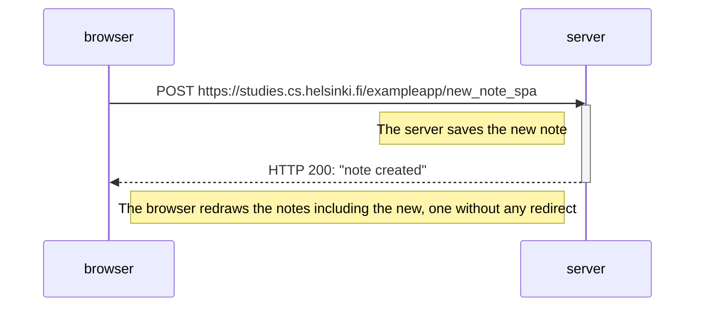

```mermaid
sequenceDiagram
    participant browser
    participant server

    browser->>server: POST https://studies.cs.helsinki.fi/exampleapp/new_note_spa
    activate server

    Note left of server: The server saves the new note

    server-->>browser: HTTP 200: "note created"
    deactivate server

    Note right of browser: The browser redraws the notes including the new, one without any redirect
```
